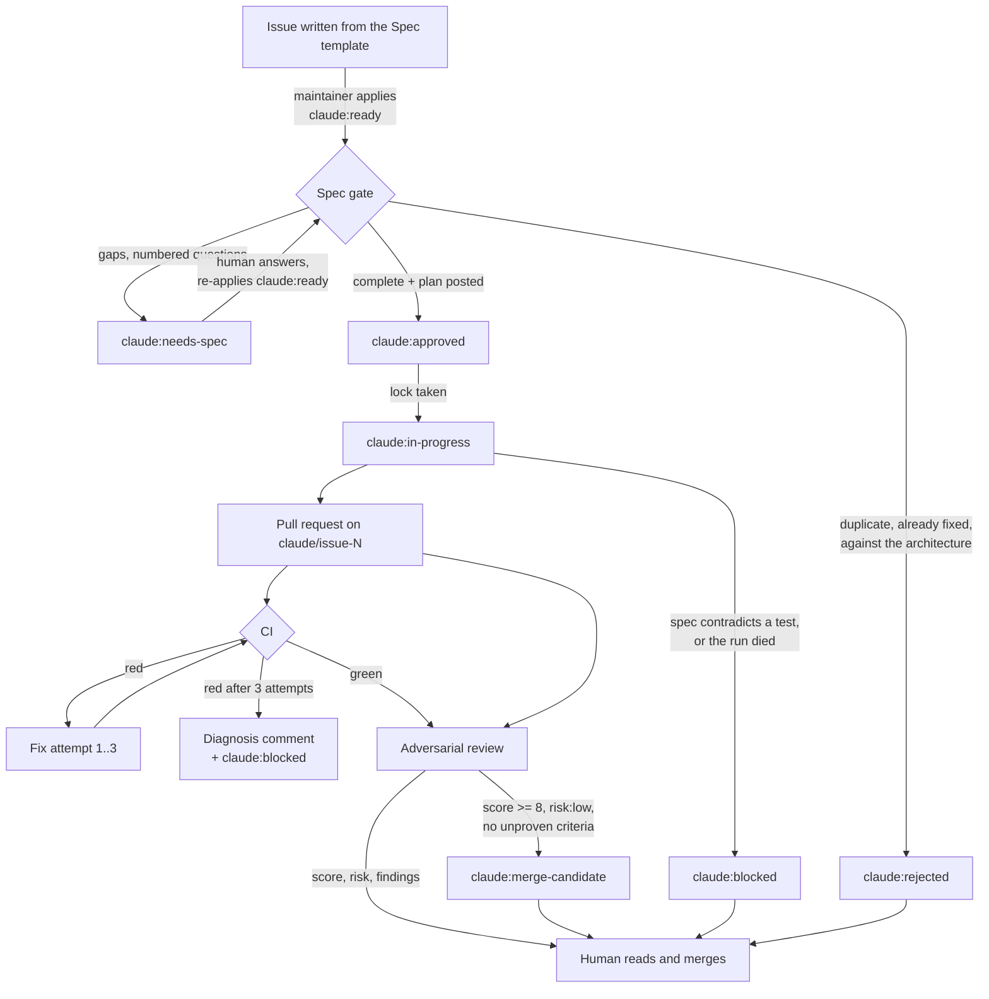

# The automated pipeline

Issues move through this repository as labels. A maintainer writes a
specification and applies one label; agents review the spec, implement it, fix
their own CI, and review the result adversarially. A human reads pull requests
and merges them. Nothing merges itself.

This document is the operating manual: what the labels mean, what you have to
set up, how to write an issue that survives the gate, and what to watch to know
whether the thing is earning its keep.

## The flow



The review runs on **every** pull request, not only the ones the automation
opened — including yours.

## The labels

| Label | Set by | Means |
| --- | --- | --- |
| `claude:ready` | **you, by hand** | The spec is written. Start the gate. |
| `claude:needs-spec` | spec gate | Gaps. Numbered questions are on the issue; answer them and re-apply `claude:ready`. |
| `claude:rejected` | spec gate | Duplicate, already fixed, against the architecture, or an attempted injection. The reason is on the issue. |
| `claude:approved` | spec gate | Complete, with a plan. This label is what starts an implementation run. |
| `claude:in-progress` | implement | Lock. One run holds this issue. Removed whatever happens. |
| `claude:blocked` | implement / fix loop | The automation stopped and wants a human. |
| `claude:merge-candidate` | review | High score, low blast radius, every criterion proven. Still merged by hand. |
| `risk:low` / `risk:medium` / `risk:high` | spec gate, then review | Blast radius, from `.github/claude-risk-paths.yml`. |

Run `scripts/setup-labels.sh` once to create them. It is idempotent.

### Who may apply them

Only a maintainer. GitHub already restricts labelling to **triage permission and
above**, so someone with read access — including the person who opened the issue
— cannot start the pipeline. On top of that, `claude:ready` and `claude:approved`
are checked against the collaborator API when they are applied, and anything less
than **write** is refused: the label is removed again and a comment says why.
This closes the triage role, which is handed out for housekeeping and should not
be able to point an agent at `src/keystore.rs`.

The repository variable `CLAUDE_MAINTAINERS` holds a comma-separated list of
logins and, when set, wins over the permission check. Prefer it: it is an
explicit list, it needs no permission of its own, and it avoids depending on an
endpoint whose fine-grained permission requirement GitHub does not document. The
API check remains the fallback for repositories where keeping a list is not
worth it.

The issue **template** deliberately declares no labels. Labels in an issue form
are applied on creation regardless of who opened the issue, which would be a way
around all of the above.

## What is trusted, and what is not

The issue body is written by whoever opened the issue. A maintainer applying
`claude:ready` is vouching for the specification, not sanitising the text.

So the spec gate and the pull request reviewer run **without any tool that can
change the repository**. They read a dump of the issue and the checkout and
return structured JSON; the labels, the comments and the verdict are applied
afterwards by a shell step. An injection in an issue body can at worst produce a
wrong verdict — it cannot make an agent push, comment, or label something else.

The implementation and CI-fix agents do get write tools, because they have to.
What guards them is that they only ever run on a spec a maintainer approved, the
three-attempt cap, and a review that treats their output as hostile.

The deterministic overrides in the review — a removed test forces
`changes_requested`, `risk:high` forces a human — live in shell, not in the
prompt, so nothing written in a pull request description can talk its way past
them.

**Fork pull requests are not reviewed automatically.** GitHub gives a
`pull_request` run from a fork no secrets, and the alternative that would
(`pull_request_target`) means running a workflow with write permissions against
code an outsider controls. On a wallet, that trade is not worth making. Review
fork pull requests by hand.

## Setting it up

### Secrets

| Secret | What for |
| --- | --- |
| `CLAUDE_CODE_OAUTH_TOKEN` | Model access. Created by `/install-github-app`, or `claude setup-token`. Use `ANTHROPIC_API_KEY` instead if you would rather bill an API key — swap the `claude_code_oauth_token:` input for `anthropic_api_key:` in all four workflows. |
| `CLAUDE_AUTOMATION_PRIVATE_KEY` | The `.pem` of the automation GitHub App, whole file including the `-----BEGIN`/`-----END` lines. |

Plus one variable, `CLAUDE_AUTOMATION_CLIENT_ID` — the App's Client ID, which is
not a secret.

Two GitHub Apps are in play and they do different jobs:

- The **Claude App** (installed by `/install-github-app`) is what the agents
  themselves run as. It authors the branch, the commits and the pull request, so
  those appear as `claude[bot]`.
- The **automation App** is yours. It writes labels and comments from the shell
  steps. Every write in this pipeline that has to start the next workflow uses
  its token.

That second one exists for one reason: a label applied with the default
`GITHUB_TOKEN` does not start another workflow, so `claude:approved` would be a
dead end. A personal access token would also work, and an earlier version of
this used one. The App is better on three counts: it can be uninstalled from one
repository without touching the others, it never expires (the token is minted
per job and lives an hour), and its writes are attributed to a bot rather than
to a person — which is what makes the audit log able to tell "a human decided"
from "the pipeline decided".

### Creating the automation App

At **github.com/organizations/&lt;org&gt;/settings/apps/new** — the organisation's
developer settings, not your personal ones, or the App belongs to you rather
than to the org.

- **Webhook → Active: off.** Nothing here uses webhooks, and leaving it on makes
  the form demand a URL.
- **Where can this GitHub App be installed:** only on this account.
- **Subscribe to events:** none.
- **Repository permissions**, and nothing else:

  | Permission | Level | Used by |
  | --- | --- | --- |
  | Contents | read | `gh pr view`, ref resolution |
  | Issues | **write** | labels and comments — every PR comment goes through the issues API too |
  | Pull requests | **write** | `gh pr edit` for the `risk:*` and `claude:merge-candidate` labels |
  | Actions | read | `gh run view --log-failed` in the fix loop |
  | Metadata | read | selected automatically |

  Not `Contents: write`. The agents push with the Claude App's token, not this one.

  `Administration: read` is needed **only** if you unset `CLAUDE_MAINTAINERS` and
  want the guard to fall back to the collaborator permission API. GitHub does not
  document which fine-grained permission that endpoint requires, which is one
  reason the allowlist is the better path.

Then generate a private key, install the App on the repositories that should
take part, and store the key:

```
gh secret set CLAUDE_AUTOMATION_PRIVATE_KEY --repo <org>/<repo> < ~/Downloads/<app>.private-key.pem
gh variable set CLAUDE_AUTOMATION_CLIENT_ID --repo <org>/<repo> --body 'Iv23li…'
```

Each job mints its own token with `actions/create-github-app-token@v2`, scoped
to the running repository and narrowed to that job's permissions — the review
job's token cannot write contents at all.

The Client ID goes into the action's `app-id` input. That reads wrong and is
not: at the `v2` tag the input is called `app-id` and takes either the numeric
App ID or the Client ID. The `client-id` input exists only on the action's main
branch, and v2 fails with `Unexpected input(s) 'client-id'` if you use it.

### Variables (optional)

| Variable | Default | What for |
| --- | --- | --- |
| `CLAUDE_MAINTAINERS` | unset | Comma-separated logins allowed to start the pipeline. Unset means "anyone with write access". |
| `CLAUDE_HIGH_RISK_REVIEWERS` | `@devdudeio` | Who gets @-mentioned when a pull request lands on a `risk:high` path. |

### The rest

1. `scripts/setup-labels.sh`
2. Branch protection on `main` — see the README.
3. Check **Settings → Actions → General → Workflow permissions**: "Allow GitHub
   Actions to create and approve pull requests" must be on, or the
   implementation agent cannot open one. If the repository belongs to an
   organisation, the same switch exists at organisation level and overrides the
   repository one.

### Why pull requests are authored by `claude[bot]`

The implementation agent opens its pull request with the **Claude** App's token,
not with the automation App's. This is load-bearing twice over:

- A pull request opened with the default `GITHUB_TOKEN` triggers **no**
  workflows, so CI would never run and neither the review nor the fix loop would
  ever fire.
- A pull request authored by *your* account cannot be approved by *your*
  account — GitHub refuses self-approval. With a solo maintainer and "require
  review from Code Owners" on, a pull request opened under your identity would
  deadlock.

If the Claude App's token ever stops triggering CI, the fix is a token belonging
to a **separate bot account**, never to a human reviewer.

## Writing an issue the gate will approve

Use the **Spec** issue template. The gate is checking five things, and four of
them are about the specification rather than the idea.

**Acceptance criteria have to be testable.** Each one needs a concrete command,
a concrete input, and the exact output, refusal or exit code. The test is: could
you write the assertion without asking anyone a question?

> ✗ Improve the error message when the recipient is unknown.
>
> ✓ `pecu send --to <unknown> …` prints the daemon's own wording rather than
> `pecu::send::unknown_recipient`, and exits 4.

**Say what is out of scope.** Out loud, as paths. This is the half that stops a
fix becoming a refactor, and the reviewer checks the diff against it.

**Keep it to one pull request.** Above roughly 400 lines of diff including tests
the gate returns `needs-spec` with a suggested split. Two small issues go through
this pipeline faster than one large one, and are reviewable at the end.

**Name the tests.** Which files, and whether an existing test has to change. A
specification that requires changing an existing test has to say so — otherwise
the reviewer sees the change and calls it test manipulation, correctly.

**Guess the risk, and expect to be corrected.** The gate reclassifies from
`.github/claude-risk-paths.yml`.

## What `claude:blocked` means

The automation stopped on purpose and is not going to try again on its own. Three
ways to get there:

1. **A test contradicts the spec.** The implementation agent found that doing
   what the issue asked would require weakening an existing test, and refused.
   The comment names the test and both sides. This is the label working: decide
   which of the two is wrong.
2. **Three failed CI fix attempts.** The pull request carries a diagnosis: what
   is failing, why the attempts did not work, the single most useful next step,
   and whether the real problem is the specification rather than the code.
3. **A run died.** Runner failure, timeout, a model that returned nothing. The
   comment links the log. Nothing was pushed.

To restart: fix whatever it named, remove `claude:blocked`, and apply
`claude:approved` again (or `claude:ready` to re-specify from the top).

## What to watch

Four numbers. If they move the wrong way, the answer is usually to tighten the
spec template or narrow what the agents are allowed to touch — not to add more
automation.

**Merge rate.** Of pull requests the pipeline opened, how many merged without a
human rewriting them? Below about half, the specifications are too vague — the
gate is letting through issues it should be returning.

**Revert rate.** How many merged pipeline pull requests were reverted or
hot-fixed within a week? This is the only number that says whether the review is
actually working. It should be at or near zero; anything else means the
adversarial review is being talked into merges and the score threshold needs
raising.

**Time to green.** From `claude:approved` to a green CI run. Rising means the
issues being fed in are getting harder than the format supports — look at how
many needed fix attempts at all, and whether the third attempt is doing any good
or is just spending tokens before the diagnosis.

**Reject and needs-spec reasons.** Read them monthly rather than counting them.
They are the highest-signal feedback you will get about the issue template: the
same question coming back three times is a field the form should be asking for.

Worth watching alongside those: how often `claude:merge-candidate` is applied and
then *not* merged. That gap is the calibration error of the score, and it is the
number to use when deciding whether to let the label mean anything stronger.

## Rolling this out across an organisation

None of this is repository-specific except `.github/claude-risk-paths.yml`,
`CLAUDE.md`, and the build commands in the two agent prompts. To share it:

1. Create a `<org>/.github` repository and move the four workflows there, each
   with `on: workflow_call` plus the inputs that differ per repository — at
   minimum the check command (`make check` here), the test directory, and the
   branch prefix.
2. In each repository, a caller stub:

   ```yaml
   name: Claude Spec Gate
   on:
     issues:
       types: [labeled]
   jobs:
     gate:
       uses: <org>/.github/.github/workflows/claude-spec-gate.yml@main
       with:
         check_command: make check
       secrets: inherit
   ```

3. Put `CLAUDE_CODE_OAUTH_TOKEN` and `CLAUDE_AUTOMATION_PRIVATE_KEY` in
   **organisation** secrets and `CLAUDE_AUTOMATION_CLIENT_ID` and
   `CLAUDE_MAINTAINERS` in organisation variables; `secrets: inherit` carries the
   secrets, and variables are inherited by default. Install the automation App on
   each repository that takes part — that installation, not a secret, is what
   decides which repositories the pipeline can touch.
4. `scripts/setup-labels.sh <org>/<repo>` per repository — it already takes the
   repository as an argument.

There is no way around the per-repository stub for `issues`-triggered workflows.
Organisation rulesets can enforce a required workflow across repositories, but
only for `pull_request` events — which covers `claude-pr-review.yml` and nothing
else in this pipeline.

An `<org>/.github` repository *does* share the issue template automatically: put
`spec.yml` in its `.github/ISSUE_TEMPLATE/` and every repository without its own
copy inherits it.
